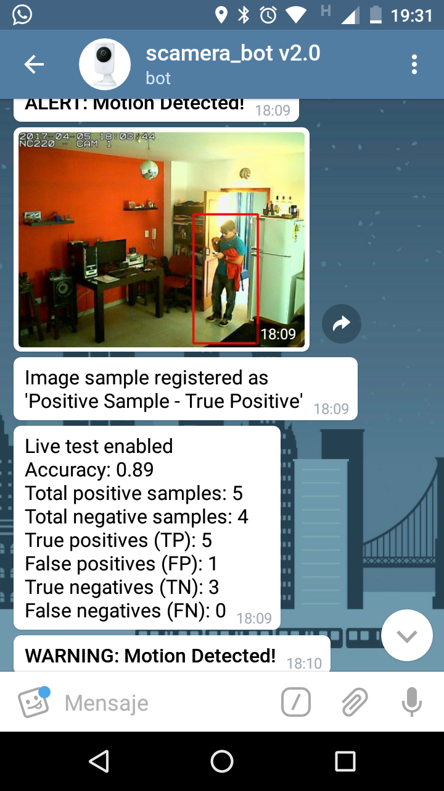

# scamera

This is a branch of the initial work in [Tero](https://github.com/teritos/tero-saas). The goal in this implementation was to test the HOG People Detector provided by [OpenCV library](https://opencv.org/).

## Screenshot

Telegram Bot receiving an Alert from a connected security camera (TPLINK-nc220). The images received are processed by the HOG algorithm to detect and mark intruders (People) in the image.

